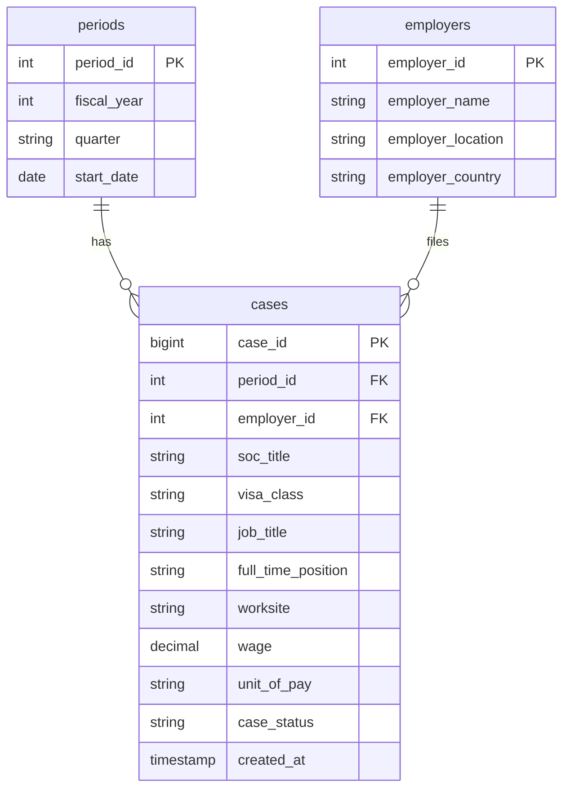

# Machine Learning Pipeline – Time Series Assignment: Structure & Roadmap

This document defines the project structure, database design (with emphasis on ERDs), and task breakdown. **SQL is the main database (source of truth); MongoDB is the cache layer for faster retrieval.**

---

## 1. Dataset Context (LCA Time-Series)

Your archive contains **LCA (Labor Condition Application) data by fiscal year** (`LCA_FY_2017.csv` … `LCA_FY_2022.csv`). To use it as **time-series** data:

| Requirement | Implementation |
|-------------|----------------|
| **Timestamp** | Derive from **Fiscal_Year** + **Quarter** (e.g. `2019-Q1`). Add a single `period` or `record_date` when loading (e.g. first day of quarter). |
| **Prediction target** | **Regression:** `Prevailing_Wage` (or `Wage_Rate_Of_Pay` after unifying column names). **Classification:** `Case_Status` (e.g. Certified vs Withdrawn). |
| **Multiple variables** | Visa_Class, SOC_Title, Employer_Location, Full_Time_Position, Unit_Of_Pay, etc. |

**Note:** Column names differ across years (e.g. `Prevailing_Wage` vs `Wage_Rate_Of_Pay`). Task 1 preprocessing must **unify schema** and **add a consistent time column** (e.g. `fiscal_year`, `quarter`, `period_id`).

---

## 2. High-Level Architecture & Data Flow

```
┌─────────────────┐     ┌──────────────────┐     ┌─────────────────┐
│  Raw CSVs       │────▶│  Preprocessing    │────▶│  MySQL (main)   │
│  (archive/)     │     │  (Task 1)         │     │  Source of truth │
└─────────────────┘     └──────────────────┘     └────────┬────────┘
                                                           │
                                    ┌──────────────────────┼──────────────────────┐
                                    │                      │                      │
                                    ▼                      ▼                      ▼
                           ┌────────────────┐    ┌────────────────┐    ┌────────────────┐
                           │  API CRUD      │    │  Cache layer   │    │  Prediction    │
                           │  (Task 3)      │◀──▶│  MongoDB       │    │  script (Task 4)│
                           └────────────────┘    │  (fast reads)  │    └────────────────┘
                                                 └────────────────┘
```

- **MySQL:** Persistent store; all inserts/updates/deletes and authoritative queries.
- **MongoDB:** Cache for **latest record** and **date-range** queries; populated/updated from MySQL or from API writes (e.g. write-through or periodic sync).
- **API:** Implements CRUD and time-series endpoints for **both** SQL and MongoDB; for reads, you can optionally serve from MongoDB first (cache hit) and fall back to SQL (cache miss).

---

## 3. Task-by-Task Breakdown

### Task 1: Time-Series Preprocessing and Exploratory Analysis

| Subtask | Deliverable | Location / Notes |
|--------|--------------|------------------|
| **1.A – Understanding** | Time range, frequency, missing values, distributions | `notebooks/01_eda.ipynb` or `scripts/eda.py` |
| | Unified schema (single wage column, fiscal_year, quarter) | Same; document in report |
| **1.B – Analytical questions** | ≥5 questions; ≥2 using **lagged features** and **moving averages** | Same notebook + report |
| | ≥1 visualization per question + interpretation | Plots in `outputs/figures/` or inline |
| **1.C – Model** | One model (e.g. Linear Regression, Random Forest, or LSTM) | `scripts/train_model.py` |
| | Hyperparameter tuning + **experiment table** (≥2 experiments) | `outputs/experiments/` or MLflow/weights & biases |

Suggested analytical questions (must include **lag + moving average**):

- Trend: Does median/mean wage have an increasing/decreasing trend over fiscal quarters?
- Correlation: Do visa class or SOC title correlate with wage over time?
- **Lagged:** Is wage in quarter Q related to wage in Q-1, Q-2, Q-4? (lagged features)
- **Moving average:** 4-quarter moving average of certification count vs target (e.g. next quarter wage)
- Seasonality: Are there quarter-of-year effects (Q1 vs Q4)?

---

### Task 2: Design Databases (SQL + MongoDB)

| Subtask | Deliverable | Location |
|--------|-------------|----------|
| **Relational schema** | Minimum **3 tables**; ERD diagram; SQL DDL scripts | `docs/ERD.md`, `database/sql/schema.sql` |
| **MongoDB** | Collection design + sample documents | `docs/MONGODB_DESIGN.md`, `database/mongodb/samples/` |
| **Queries** | ≥3 queries per DB + results | `database/sql/queries.sql`, `database/mongodb/queries.js` (or .py), results in report |

See **Section 4 (ERD)** and **Section 5 (MongoDB)** below for concrete designs.

---

### Task 3: CRUD + Time-Series Endpoints

| Requirement | SQL | MongoDB |
|-------------|-----|---------|
| **POST** | Create record(s) | Create document(s) (and optionally sync to SQL or vice versa) |
| **GET** | Read by id / list | Read by id / list |
| **PUT** | Update record | Update document |
| **DELETE** | Delete record | Delete document |
| **Latest record** | `ORDER BY time_column DESC LIMIT 1` | Sort by time, limit 1 |
| **Date range** | `WHERE time_column BETWEEN ? AND ?` | `find({ "period": { "$gte": start, "$lte": end } })` |

Implement in a single API (e.g. FastAPI/Flask): e.g. `/sql/...` and `/mongo/...` or `/cache/...` routes. Location: `api/` or `src/api/`.

---

### Task 4: Prediction / Forecast Script

End-to-end script that:

1. **Fetches** a time-series record (or window) from your API (e.g. latest or date range).
2. **Preprocesses** using the same pipeline as Task 1 (same scaling, lags, moving averages).
3. **Loads** the trained model (e.g. pickle/joblib or SavedModel).
4. **Runs** prediction/forecast and outputs result.

Location: `scripts/predict.py` or `src/predict.py`. Document in report and README.

---

## 4. ERD and Relational Schema (Emphasis)

### 4.1 Conceptual ERD (Entities and Relationships)

- **Period** – One row per time interval (e.g. fiscal year + quarter). Attributes: `period_id` (PK), `fiscal_year`, `quarter`, `start_date`, `end_date`.
- **Employer** – One row per employer (deduplicated by name/location). Attributes: `employer_id` (PK), `employer_name`, `employer_location`, `employer_country`.
- **SOC** – Standard Occupational Classification. Attributes: `soc_id` (PK), `soc_title`, optional `soc_code` if you extract it.
- **Case / Application** – One LCA application. Attributes: `case_id` (PK), `period_id` (FK → Period), `employer_id` (FK → Employer), `soc_id` (FK → SOC), `visa_class`, `job_title`, `full_time_position`, `worksite`, `wage`, `unit_of_pay`, `case_status`, `created_at`, etc.

Relationships:

- **Period** 1 ──▶ N **Case** (each case belongs to one period).
- **Employer** 1 ──▶ N **Case** (each case has one employer).
- **SOC** 1 ──▶ N **Case** (each case has one SOC title).

This gives **at least 4 tables** (Period, Employer, SOC, Case); you can reduce to 3 by merging Period into Case if you only need `fiscal_year` and `quarter` on the case row (see minimal 3-table option below).

### 4.2 Minimal 3-Table Option (Still Valid ERD)

If you want exactly 3 tables:

1. **periods** – `period_id`, `fiscal_year`, `quarter`, `start_date`.
2. **employers** – `employer_id`, `employer_name`, `employer_location`, `employer_country`.
3. **cases** – `case_id`, `period_id` (FK), `employer_id` (FK), `soc_title` (denormalized string), `visa_class`, `job_title`, `full_time_position`, `worksite`, `wage`, `unit_of_pay`, `case_status`, `created_at`.

ERD: **periods** 1 ──▶ N **cases**; **employers** 1 ──▶ N **cases**.

### 4.3 Logical ERD (Mermaid)

See `docs/ERD.md` for the same diagram and full SQL. Example:



### 4.4 Physical SQL Schema (Summary)

- **periods:** PK `period_id`, unique on (`fiscal_year`, `quarter`).
- **employers:** PK `employer_id`, index on `employer_name` (and optionally location) for lookups.
- **cases:** PK `case_id`, FKs `period_id`, `employer_id`; indexes on `period_id`, `case_status`, and `created_at` (or a single time column) for date-range and “latest” queries.

Full DDL: `database/sql/schema.sql`.

---

## 5. MongoDB Collection Design (Cache)

Use MongoDB for **fast retrieval** of time-series views, not as the only store.

- **Collection name:** e.g. `lca_records` or `time_series_cache`.
- **Document shape:** One document per **case** (or per aggregated period, depending on what the API returns). Prefer one document per case for parity with SQL and simpler cache invalidation.

Example document (aligned with API “latest” and “date range” responses):

```json
{
  "_id": ObjectId("..."),
  "case_id": 123456,
  "period": {
    "fiscal_year": 2022,
    "quarter": "Q1",
    "start_date": "2022-01-01",
    "end_date": "2022-03-31"
  },
  "employer_name": "Example Corp",
  "employer_location": "New York, New York",
  "soc_title": "Software Developers, Applications",
  "visa_class": "H-1B",
  "job_title": "Software Engineer",
  "full_time_position": "Y",
  "wage": 120000.0,
  "unit_of_pay": "Year",
  "case_status": "Certified",
  "created_at": ISODate("2022-02-15T00:00:00Z"),
  "cached_at": ISODate("2025-03-01T12:00:00Z")
}
```

Indexes:

- `{ "period.start_date": 1 }` or `{ "created_at": -1 }` for **latest record**.
- `{ "period.start_date": 1, "period.end_date": 1 }` or `{ "created_at": 1 }` for **date range**.
- Optional: `{ "case_id": 1 }` unique for cache consistency.

Sample documents: `database/mongodb/samples/sample_documents.json`. Design rationale: `docs/MONGODB_DESIGN.md`.

---

## 6. Recommended Repository Structure

```
Machine-Learning-Pipeline-Formative1/
├── README.md
├── ASSIGNMENT_STRUCTURE.md          # this file
├── archive/                          # raw data (existing)
│   └── LCA_FY_*.csv
├── data/                             # processed / unified data (Task 1 output)
│   ├── processed/
│   └── train_test/
├── database/
│   ├── sql/
│   │   ├── schema.sql
│   │   ├── seed.sql                  # optional sample data
│   │   └── queries.sql
│   └── mongodb/
│       ├── samples/
│       │   └── sample_documents.json
│       └── queries.js
├── docs/
│   ├── ERD.md                        # ERD narrative + Mermaid
│   ├── ERD.png                       # exported diagram for report
│   └── MONGODB_DESIGN.md
├── notebooks/                        # Task 1 EDA + analytics
│   └── 01_eda.ipynb
├── scripts/                          # Task 1–4
│   ├── preprocess.py
│   ├── train_model.py
│   └── predict.py
├── api/                              # Task 3
│   ├── main.py                       # FastAPI/Flask app
│   ├── routes_sql.py
│   ├── routes_mongo.py
│   └── config.py
├── models/                            # saved model + metadata
│   ├── model.joblib
│   └── config.json
├── outputs/
│   ├── figures/
│   ├── experiments/
│   └── predictions/
├── requirements.txt
└── report.pdf                        # final deliverable (or link)
```

---

## 7. Deliverables Checklist

| Deliverable | Content |
|-------------|---------|
| **PDF report** | Problem definition, dataset justification, Task 1–4 implementation, ERD figure, MongoDB design, query results, team contributions |
| **GitHub repo** | Code, README, this structure, clear commit history (≥4 commits per member for exemplary) |
| **ERD** | Conceptual/logical description + diagram (Mermaid + exported PNG for report) |
| **SQL** | DDL in `database/sql/schema.sql`; ≥3 queries with results in report |
| **MongoDB** | Design doc + sample docs; ≥3 queries with results in report |
| **API** | CRUD + latest + date-range for both SQL and MongoDB |
| **Prediction script** | Fetch → preprocess → load model → predict; documented in README |

---

## 8. Suggested Order of Work

1. **Task 1.A–B:** Unify CSVs, add `fiscal_year`/`quarter`, EDA, analytical questions (with lags and moving averages), visualizations.
2. **Task 2:** Finalize ERD (conceptual → logical → physical), write `schema.sql`, implement MongoDB collection and indexes, run and document ≥3 queries per DB.
3. **Task 1.C:** Train model, hyperparameter tuning, experiment table.
4. **Task 3:** Implement API (CRUD + latest + date range for SQL and MongoDB).
5. **Task 4:** Prediction script using API + preprocessing + saved model.
6. **Report + README:** Compile figures, query results, ERD, and contribution summary.

Using **MongoDB as cache** and **SQL as main DB** is reflected in the architecture (Section 2), ERD (Section 4), and MongoDB design (Section 5). Emphasize the ERD in the report with a clear diagram and a short narrative linking entities to your time-series use case.
