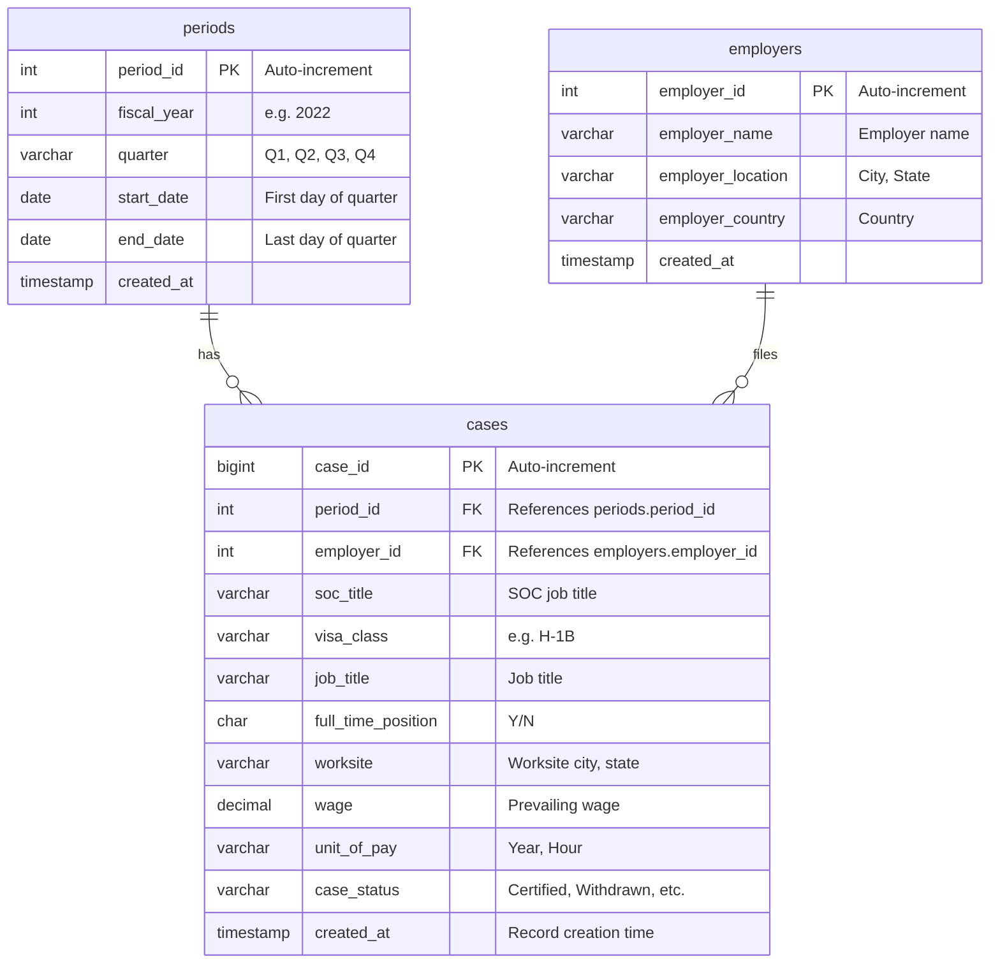

# Entity-Relationship Design (ERD)

This document describes the **relational database design** for the LCA time-series pipeline. The **main database is MySQL** (source of truth); **MongoDB is used as a cache** for fast retrieval (see `MONGODB_DESIGN.md`).

---

## 1. Design Goals

- Support **time-series** queries: by period (fiscal year + quarter), latest record, date range.
- **Normalize** employers and periods to avoid repetition and support analytics.
- **Minimum 3 tables** (we use 3: `periods`, `employers`, `cases`).
- Clear **relationships** for ERD grading and report.

---

## 2. Conceptual ERD – Entities and Relationships

| Entity    | Description                    | Main attributes |
|----------|--------------------------------|------------------|
| **Period**   | One row per fiscal quarter      | period_id, fiscal_year, quarter, start_date |
| **Employer** | One row per distinct employer   | employer_id, employer_name, employer_location, employer_country |
| **Case**     | One LCA application record      | case_id, period_id (FK), employer_id (FK), soc_title, visa_class, job_title, wage, case_status, created_at |

**Relationships:**

- **Period 1 ──▶ N Case:** Each case belongs to exactly one period (fiscal quarter).
- **Employer 1 ──▶ N Case:** Each case is filed by one employer.

So: **Period** and **Employer** are dimension tables; **Case** is the fact table with a clear time axis (`period_id` / `created_at`).

---

## 3. Logical ERD (Mermaid)

---

## 4. Relationship Cardinality

| From      | To      | Cardinality | Meaning |
|-----------|---------|-------------|---------|
| periods   | cases   | 1 : N       | One period has many cases. |
| employers | cases   | 1 : N       | One employer has many cases. |

Optional: If you add a **SOC** table later (4th table), then **soc 1 ──▶ N cases** (each case has one SOC).

---

## 5. Key Decisions for Time-Series and Reporting

1. **Time axis:** `periods` table gives a single time dimension; `cases.created_at` can store insert time for “latest record” queries.
2. **Indexes:** On `cases(period_id)`, `cases(created_at)` (or both) for date-range and latest-record performance.
3. **Wage:** Single numeric `wage` column; `unit_of_pay` indicates Year vs Hour (normalization of wage to yearly can be done in app or in a view).
4. **ERD for report:** Export this Mermaid to PNG (e.g. via Mermaid Live Editor or `mmdc`) and include in the PDF as the official ERD figure.

---

## 6. Exporting the Diagram for the Report

- **Online:** [Mermaid Live Editor](https://mermaid.live) – paste the diagram, export as PNG/SVG.
- **CLI:** `npm install -g @mermaid-js/mermaid-cli` then `mmdc -i docs/ERD.md -o docs/ERD.png` (if you save the Mermaid block to a `.mmd` file).

Use **Section 3** as the single source for the ERD diagram in your report.
